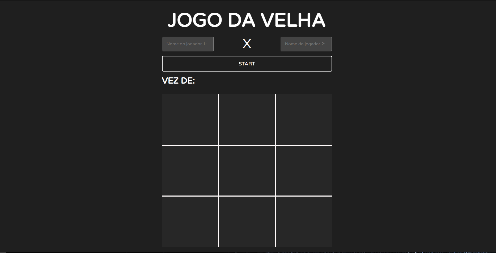
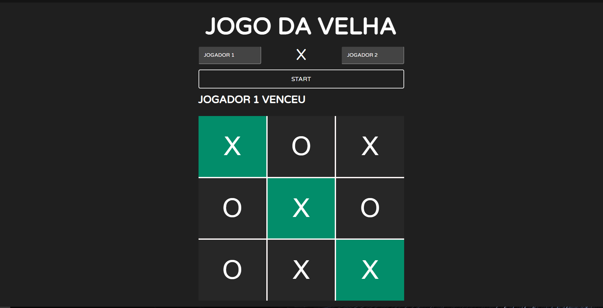

# 🕹 JOGO DA VELHA

Jogo da velha realizado no intuito de treinar alguns conceitos de programação em front-end, tais como a estilização em grid e manipulação do DOM com javascript.

[🔗 Clique aqui para acessar](https://vtssbr.github.io/TicTacToe/)

# 📃 Regras

Participam duas pessoas, que jogam alternadamente, preenchendo cada um dos espaços vazios. Cada participante deve usar um símbolo (X ou O). Vence o jogador que conseguir formar primeiro uma linha com três símbolos iguais, seja ela na horizontal, vertical ou diagonal.

# 📢 Como Jogar

Primeiro digite o nome dos jogadores no campos de texto, em seguida clique no botao start para dar inicio ao jogo, logo apos a rodada finalizar com uma vitoria ou empate, basta clicar no botao de start para reniciar.

# 🛠 Tecnologias 
- HTML
- CSS
- Javascript
- Git
- GitHub

